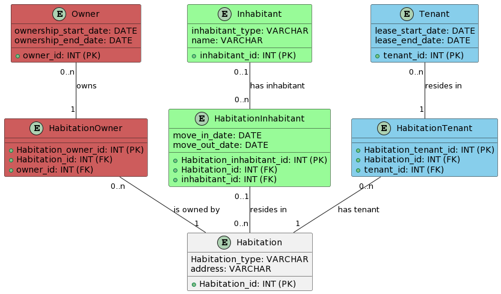

# Curubi : Exercices de recrutement

## 1 - Frontend
* [Site déployé](https://tgicquel-curubi-deploy.vercel.app) disponible via Vercel [https://tgicquel-curubi-deploy.vercel.app](https://tgicquel-curubi-deploy.vercel.app)
* Accessible localement avec `npm install` puis `npm run dev` ( naviguer dans le dossier `./1_integration` au préalable)
* Temps approximatif : 3h

### Fonctionnalités
* Pile Technologique utilisée : [SvelteKit](https://kit.svelte.dev/)  + [Tailwind css](https://tailwindcss.com/)
* Animations cosmétiques (CSS)

### Apercu


### Améliorations possibles
* Responsive mobile
* Respect des normes d'accessibilité
* Remplissage des autres sections

## 2 - Debugging C# Windows Form

### Enoncé
`ws Form
Corriger le programme "Exercice2\bin\Release\net6.0-windows\Exercice2.exe" qui génère une erreur d'exécution lors du clic sur le bouton [Start].

### Refléxion 
1. L'objectif du programme étant inconnu, la tâche restera de corriger l'exception soulevée ainsi que les suivantes pouvant être découvertes lors de la correction.
2. On constate simplement l'erreur arithmétique de division par Zéro causée par le décrément de `div`, on effectue donc une vérification de valeur sur les deux membres de la division.
```cs
//...
int yo;
if(div>0 && max > 0){
    yo = max / div;
}
//...
``` 
3. On observe le passage du compteur en valeurs tendant vers l'infini négatif, puis dans les négatifs.
4. Sans contexte supplémentaire et aucune erreur d'exécution constatée, l'exercice est considéré comme complété.


## 3 - Database
### Enoncé
Réaliser le diagramme du modèle physique pour une base de données relationnelle qui stockera des logements (appartement et maison) et leurs habitants (locataire et propriétaire).

Ce modèle contiendra les entités (tables), les attributs (champs) et leurs types, les identifiants (clés primaires) et les relations (clés étrangères issues des cardinalités).

### Résultat

